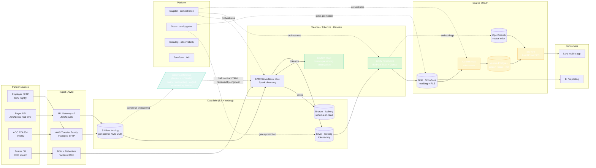

# Trusted Partner Eligibility & Identity Verification Platform

> **Lore Health — Staff Data Engineer Case Study #3**
> Reference architecture and working prototype for ingesting partner eligibility data (PII)
> at scale, cleansing it under HIPAA controls, and serving it as the trusted source of truth
> for new account creation.

**30 passing tests · runs locally with no AWS access · two AI features powered by Bedrock.**

---

## For the panel — start here

| If you have… | Open |
|---|---|
| **45 minutes** to walk the full case study | [PRESENTATION.md](PRESENTATION.md) — section-by-section speaker script |
| **10 minutes** for the live demo only | [DEMO.md](DEMO.md) — verified-working command-by-command runbook |
| A browser and want **slides** | [slides/index.html](slides/index.html) — self-contained reveal.js deck (27 slides) · also at [slides/slides.marp.md](slides/slides.marp.md) for Google Slides import |
| **5 minutes** to skim before the call | this README |

---

## What this solves (in plain English)

Lore signs deals with employers, brokers, payers, and Medicare ACOs. Each of them sends us a
list of people who are *eligible* to use the Lore app — usually with name, date of birth,
address, sometimes SSN, and an internal partner ID. Three things make this hard:

1. **Every partner sends data differently.** One sends a CSV over SFTP nightly. Another sends
   a JSON API push. A payer sends X12 834 EDI files weekly. Field names, formats, and quality
   vary enormously.
2. **The data is PHI and we are HIPAA-regulated.** We cannot just dump it into a data lake.
   It must be encrypted, tokenized, access-controlled, auditable, and minimized.
3. **It is the source of truth for who gets an account.** If a member tries to sign up and we
   can't match them to an eligibility record, they cannot use Lore. Bad matching → bad UX.
   Wrong matching → one person sees another's data → breach.

This repo is a working prototype designed to handle 100M+ eligibility records across hundreds
of partners, with sub-minute freshness on incremental updates and 99.95% availability on the
verification API.

---

## What the brief asks for, mapped to this repo

| Brief asks for | Where it lives |
|---|---|
| Data quality standards | [docs/data-quality-standards.md](docs/data-quality-standards.md) |
| PII governance & HIPAA controls | [docs/pii-governance.md](docs/pii-governance.md) |
| Integration strategy — bulk + CDC | [docs/architecture.md §3.3](docs/architecture.md), [services/cdc_handler/](services/cdc_handler/) |
| Automated cleansing & curation | [transformations/dbt/models/silver/](transformations/dbt/models/silver/), [pipelines/soda/checks.yml](pipelines/soda/checks.yml) |
| Identity verification system design | [docs/architecture.md §3.7](docs/architecture.md), [services/identity_verification_api/](services/identity_verification_api/) |
| Performance & freshness SLOs | [docs/slos.md](docs/slos.md) |
| Migration & delivery plan | [docs/migration-plan.md](docs/migration-plan.md) |
| Cost estimate at two scales | [docs/cost-estimate.md](docs/cost-estimate.md) |
| **Hands-on:** SQL DDL for curated store | [schemas/ddl/](schemas/ddl/) — bronze, silver, gold (Snowflake), Aurora |
| **Hands-on:** SQL for inconsistency / duplicate-PII detection | [schemas/ddl/05_cleansing_examples.sql](schemas/ddl/05_cleansing_examples.sql) |
| **Hands-on:** versioned partner data contract | [schemas/data_contracts/partner_acme_employer_v1.yml](schemas/data_contracts/partner_acme_employer_v1.yml) |
| **Hands-on:** Avro schema for CDC events | [schemas/avro/eligibility_event.avsc](schemas/avro/eligibility_event.avsc) |
| Working prototype | [services/](services/), [tests/](tests/) — `pytest` runs in <1s |

---

## Architecture at a glance



See [docs/architecture.md](docs/architecture.md) for the full version with rationale on every choice.

---

## Tech stack — why these choices

This is **AWS-first**, with non-AWS components substituted only where they meaningfully outperform
the AWS-native option. Each substitution is justified in [docs/architecture.md](docs/architecture.md).

| Layer | Choice | Why |
|---|---|---|
| Object storage | **AWS S3** + **Apache Iceberg** | Open table format gives us schema evolution, time travel, ACID — Glue tables alone don't. |
| Ingest (file) | **AWS Transfer Family** (SFTP) + **EventBridge** | Managed, HIPAA-eligible, no self-hosted SFTP. |
| Ingest (stream / CDC) | **Amazon MSK** + **Debezium** | Row-level CDC for any source DB; superior to AWS DMS for granularity, replay, and event-shape control. |
| Schema registry | **Confluent Schema Registry** | Better compatibility-checking modes than Glue Schema Registry. |
| Orchestration | **Dagster Cloud** (hybrid agent on EKS) | Asset-aware, native data contracts, lineage out of the box — superior to Step Functions or MWAA for data ops. |
| Transformation | **dbt Core** on **Snowflake** | Snowflake separates compute / storage cleanly, has dynamic data masking & row-access policies for HIPAA — superior to Redshift here. |
| Data quality | **Soda Core** + **Soda Cloud** | Declarative YAML checks integrate with Dagster as gates; better DX than Deequ. |
| PII vault | **Skyflow Data Privacy Vault** | Purpose-built tokenization vault for PHI/PII; isolates raw PII from analytics plane. Field-level access controls with policy-as-code. |
| Encryption | **AWS KMS** customer-managed keys, **per partner** | BAA-compliant; rotation; partner-level revocation = cryptographic shredding on offboarding. |
| PII discovery | **AWS Macie** | Scheduled scans of raw landing zone for unexpected PII drift. |
| Entity resolution | **Custom service** — Splink-style deterministic + Bedrock Titan embeddings + Claude adjudication | Hybrid rules + ML beats either alone for "Bob vs Robert", typos, address variants. Auditable. |
| **AI inference** | **Amazon Bedrock** (Claude Sonnet + Titan embeddings) | (1) Schema inference + PII auto-classification at partner onboarding. (2) Embedding-based fuzzy match. (3) LLM adjudication of borderline matches. (4) Anomaly explanations on data-quality alerts. |
| Identity verification API | **FastAPI on ECS Fargate** + **Aurora PostgreSQL** + **OpenSearch** | p99 < 150ms; OpenSearch holds vector embeddings for fuzzy resolution; Aurora is the hot read store. |
| Observability | **Datadog** + **OpenLineage** | Unified metrics / logs / traces + open-standard data lineage across Dagster, dbt, Spark. |
| IaC | **Terraform** | Multi-account, environment-parametrized, drift detection. |

---

## The two AI features — what they do, why they matter

Both are powered by **Amazon Bedrock** (Claude Sonnet for reasoning, Titan Text v2 for embeddings).
Both have a deterministic local-mock fallback so the prototype runs offline.

### 1. Schema inference & PII auto-classification

When a new partner sends a file in a format we've never seen, instead of an engineer spending
3–5 days writing a parser and a PII matrix, we send a 50-row sample to Claude on Bedrock with a
structured prompt. It returns:

- A canonical mapping of source columns → our internal eligibility schema, with confidence per column
- A PII tier per column — `TIER_1_DIRECT`, `TIER_2_QUASI`, `TIER_3_SENSITIVE`, or `TIER_4_NONE`
- Suggested cleansing rules (regex, date-format coercions, normalization)
- An overall data-quality risk assessment

Output is rendered as a draft data-contract YAML that an engineer reviews and signs off before
promoting to production. **Time-to-onboard a partner drops from ~5 days to <1 hour of human review.**

→ See [services/schema_inference/](services/schema_inference/), [schemas/data_contracts/partner_acme_employer_v1.yml](schemas/data_contracts/partner_acme_employer_v1.yml)

### 2. Embedding-based entity resolution

Deterministic matching ("same SSN → same person") only takes us so far — partners often *don't*
send SSN, or send it with typos, and names like "Bob" vs "Robert" break exact matching.

The resolver runs in three stages:

1. **Deterministic blocking** — exact tokenized SSN, or DOB + soundex(name) + ZIP5 → ~70% of cases auto-resolve here.
2. **Embedding retrieval** — Bedrock Titan embeds the (name, DOB, address) tuple; OpenSearch k-NN returns the top-K nearest existing golden records.
3. **LLM adjudication** — Claude scores each plausible pair and returns `{decision, confidence, reasoning}`. The reasoning is persisted for audit. Above 0.95 → auto-merge; 0.80–0.95 → human review queue; below → new golden record.

Why **Bedrock over OpenAI** direct: same VPC, no egress, one BAA already covers it, and we can
swap Claude for Llama or Mistral without rewriting code.

→ See [services/entity_resolution/](services/entity_resolution/)

---

## Running the prototype locally

The Bedrock-dependent paths fall back to deterministic local mocks when AWS isn't reachable, so
everything below works offline. The 30 unit tests run in under a second.

```bash
# 1. Set up a venv and install deps (one time)
python3 -m venv .venv && source .venv/bin/activate
pip install -e ".[dev]"

# 2. Run the full test suite
PYTHONPATH=. pytest tests/ -v
# expect: 30 passed

# 3. Schema-inference CLI on a sample partner CSV
PYTHONPATH=. python -m services.schema_inference.cli \
    samples/partner_acme_employer.csv --mode local
# prints a draft data-contract YAML to stdout

# 4. Entity-resolution end-to-end demo (4 cases, all 3 stages)
PYTHONPATH=. python -m services.entity_resolution.demo

# 5. Identity Verification API (in one terminal)
PYTHONPATH=. uvicorn services.identity_verification_api.main:app --port 8000

# 6. Hit the IDV API (in another terminal)
curl -s http://localhost:8000/healthz                                                 # → "ok"
curl -s http://localhost:8000/v1/verify -H 'Content-Type: application/json' \
  -d @samples/verify_nickname.json   | python -m json.tool                            # → VERIFIED
curl -s http://localhost:8000/v1/verify -H 'Content-Type: application/json' \
  -d @samples/verify_ineligible.json | python -m json.tool                            # → INELIGIBLE
curl -s http://localhost:8000/v1/verify -H 'Content-Type: application/json' \
  -d @samples/verify_not_found.json  | python -m json.tool                            # → NOT_FOUND
```

### Toggling Bedrock vs local mode

| Variable | Default | Effect |
|---|---|---|
| `LORE_SCHEMA_INFERENCE_MODE` | `auto` | `auto` tries Bedrock, falls back to local heuristic on any error. Set `local` to force-skip Bedrock; set `bedrock` to require it. |
| `LORE_EMBED_MODE` | `auto` | Same semantics for the entity-resolution embedder. |
| `LORE_BEDROCK_MODEL` | `anthropic.claude-3-5-sonnet-20241022-v2:0` | Override the inference / adjudication model. |
| `LORE_BEDROCK_EMBED_MODEL` | `amazon.titan-embed-text-v2:0` | Override the embedding model. |
| `LORE_PII_VAULT_BACKEND` | `local` | `local` = in-memory vault for tests / demo. `skyflow` would route to a real vault in production. |
| `LORE_IDV_SEED_FILE` | `samples/golden_records_seed.json` | Path to the JSON file the IDV API loads as its golden-record store. |

### Optional: dbt and Soda

dbt and Soda are wired up as pipeline components but require their own profiles and a target
database (DuckDB locally, Snowflake in production). They're not part of the offline demo path.
See [transformations/dbt/profiles.example.yml](transformations/dbt/profiles.example.yml) for the
DuckDB / Snowflake profile template.

---

## Performance & reliability targets (SLOs)

Full definitions and error-budget policy in [docs/slos.md](docs/slos.md). Headlines:

| Target | Value |
|---|---|
| **IDV API availability** (primary SLO) | 99.95% / 30 days |
| **IDV API p99 latency** (primary SLO) | < 150 ms |
| **CDC end-to-end freshness** — partner DB commit → Aurora golden record | p95 < 90 sec |
| **Match precision** — sampled audit | ≥ 99.5% |
| Match recall | ≥ 97% |
| Bulk load throughput into Iceberg bronze | ≥ 50M rows / hour |
| File land → available in IDV API (bulk path) | p95 < 15 min |
| PII auto-classification accuracy on labeled holdout | ≥ 98% |

Error-budget policy is enforced: when we burn 50% of any primary SLO, non-critical feature
work in that area halts until we're back inside.

---

## Repo layout

```
lore-eligibility-platform/
├── README.md                         # this file
├── PRESENTATION.md                   # 45-min panel speaker script
├── DEMO.md                           # 10-min live-demo runbook
├── slides/
│   ├── index.html                    # self-contained reveal.js deck (27 slides)
│   ├── slides.marp.md                # same deck as Marp markdown for PPTX / Google Slides
│   └── README.md                     # which deck to use, keyboard shortcuts
│
├── docs/
│   ├── architecture.md               # full architecture + component-by-component rationale
│   ├── data-quality-standards.md     # quality dimensions, gates, ownership
│   ├── pii-governance.md             # HIPAA controls, tokenization, access policy
│   ├── slos.md                       # SLOs and error-budget policy
│   ├── migration-plan.md             # 6-phase rollout from current state to target state
│   └── cost-estimate.md              # AWS + vendor cost at launch (1M) and growth (10M) scale
│
├── infra/terraform/                  # AWS IaC (KMS per-partner, S3 landing, MSK, Aurora, ECS, EKS, Macie, …)
│
├── pipelines/
│   ├── dagster_project/              # asset-aware orchestration
│   └── soda/                         # data-quality checks (incl. P0 PII-leak detector)
│
├── services/                         # Python services (the working prototype)
│   ├── schema_inference/             # ★ AI: Bedrock-powered partner schema detection + PII tiering
│   ├── entity_resolution/            # ★ AI: deterministic + embedding + LLM-adjudicated matching
│   ├── pii_vault/                    # Skyflow-pattern tokenization client with policy gates
│   ├── identity_verification_api/    # FastAPI source-of-truth service for new account creation
│   └── cdc_handler/                  # Debezium consumer with PII-tokenize-at-edge
│
├── transformations/dbt/              # bronze → silver → gold dbt models with quality flags
│
├── schemas/
│   ├── ddl/                          # SQL DDL — bronze (Iceberg), silver, gold (Snowflake), Aurora
│   │                                  # plus 05_cleansing_examples.sql for inconsistency detection
│   ├── data_contracts/               # versioned partner data contracts (YAML)
│   └── avro/                         # event schemas for CDC topics
│
├── samples/                          # synthetic partner files (CSV / JSON / X12 EDI 834) + IDV inputs
├── tests/                            # 30 unit tests; pytest in <1 sec, no AWS needed
│
├── docker-compose.yml                # local IDV API container
├── Dockerfile.idv                    # multi-stage, non-root, distroless-style for ECS Fargate
├── pyproject.toml                    # dependencies + ruff / mypy / pytest config
└── .github/workflows/ci.yml          # lint + tests on Python 3.11 & 3.12, Terraform validate, contract validate
```

---

## What I would do differently in a real Lore environment

- **Talk to partners and read existing pipeline code first.** Half this design is informed by
  *guesses* about what your real partner files look like and what your current ingest looks
  like. Two weeks of discovery — interviewing the squad, reading code, looking at five real
  partner files, pulling 30 days of "member couldn't sign up" tickets — would change details
  before I committed to architecture.
- **Build the migration cut-over plan with operations.** The interesting risk isn't building
  the new system — it's running both in parallel, reconciling nightly, and turning the old one
  off without breaking IDV for live members. See [docs/migration-plan.md](docs/migration-plan.md)
  for the dual-run-then-cutover plan; the actual phasing should come from a working session
  with the on-call team.
- **Use AI to help, never to decide on its own.** A staff engineer's job is to make sure that
  when the AI gets something wrong, a human gets alerted fast — with enough context to fix it
  inside ten minutes. In practice that means three things:
    - When the AI suggests how to interpret a new partner's file, an engineer reviews and signs
      it off in git before any data flows through it.
    - When the AI tries to match a sign-up to an existing member but isn't confident enough, the
      match goes into a human review queue instead of being merged automatically.
    - Before we upgrade to a newer version of the AI model, we test it against a set of
      known-correct examples first to confirm the new model is actually better than the old one.

  The AI is fast and saves real engineering time. It isn't trusted on its own.
