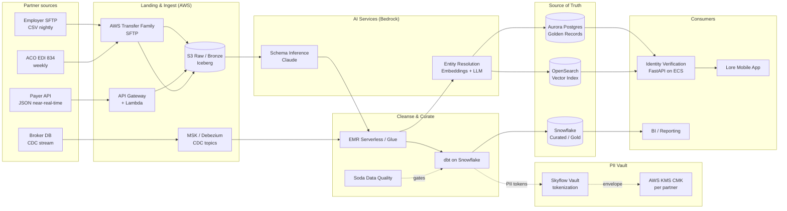

# Trusted Partner Eligibility & Identity Verification Platform

> **Lore Health — Staff Data Engineer Case Study #3**
> A reference architecture and working prototype for ingesting partner eligibility data (PII)
> at scale, cleansing it, and serving it as the trusted source of truth for new account creation.

---

## What this solves (in plain English)

Lore signs deals with employers, brokers, payers, and Medicare ACOs. Each of them sends us
a list of people who are *eligible* to use the Lore app — usually with name, date of birth,
address, sometimes SSN, and an internal partner ID. Three problems make this hard:

1. **Every partner sends data differently.** One sends a CSV over SFTP nightly. Another sends a
   JSON API push. A payer sends X12 834 EDI files weekly. Field names, formats, and quality vary.
2. **The data is PII and we are HIPAA-regulated.** We cannot just dump it into a data lake.
   It must be encrypted, tokenized, access-controlled, auditable, and minimized.
3. **It is the source of truth for who gets an account.** If a member tries to sign up and we
   can't match them to an eligibility record, they cannot use Lore. Bad matching → bad UX → churn.
   Wrong matching → wrong person sees someone else's data → breach.

This repo is a working prototype that demonstrates how I would solve this at staff-engineer scale,
designed to handle 100M+ eligibility records across hundreds of partners, with sub-minute freshness
on incremental updates and 99.95% availability on the verification API.

---

## The four-step task from the brief, mapped to this repo

| Brief asks for | Where it lives |
|---|---|
| Data quality standards & PII governance | [docs/data-quality-standards.md](docs/data-quality-standards.md), [docs/pii-governance.md](docs/pii-governance.md) |
| Integration strategy (bulk + CDC) | [docs/architecture.md](docs/architecture.md), [services/cdc_handler/](services/cdc_handler/) |
| Automated cleansing & curation | [transformations/dbt/](transformations/dbt/), [pipelines/soda/checks.yml](pipelines/soda/checks.yml) |
| Identity verification system design | [docs/architecture.md](docs/architecture.md), [services/identity_verification_api/](services/identity_verification_api/) |
| **Hands-on:** SQL DDL for curated store | [schemas/ddl/](schemas/ddl/) |
| **Hands-on:** cleansing code for inconsistencies | [services/entity_resolution/](services/entity_resolution/), [transformations/dbt/models/silver/](transformations/dbt/models/silver/) |
| Migration & delivery plan | [docs/migration-plan.md](docs/migration-plan.md) |

---

## Architecture at a glance



See [docs/architecture.md](docs/architecture.md) for the full version with rationale on every choice.

---

## Tech stack — why these choices

This is **AWS-first**, with non-AWS components substituted only where they meaningfully outperform
the AWS-native option. Each substitution is justified in [docs/architecture.md](docs/architecture.md).

| Layer | Choice | Why |
|---|---|---|
| Object storage | **AWS S3** + **Apache Iceberg** | Open table format gives us schema evolution, time travel, ACID — Glue tables alone don't. |
| Ingest (file) | **AWS Transfer Family** (SFTP) + **EventBridge** | Managed, HIPAA-eligible, no self-hosted SFTP. |
| Ingest (stream/CDC) | **Amazon MSK** + **Debezium** | Debezium gives row-level CDC for any source DB; superior to AWS DMS for granularity and replay. |
| Schema registry | **Confluent Schema Registry** (on MSK) | Better compatibility-checking modes than Glue Schema Registry. |
| Orchestration | **Dagster Cloud** (hybrid agent on EKS) | Asset-aware, native data contracts, lineage out of the box — superior to Step Functions or MWAA for data ops. |
| Transformation | **dbt Core** on **Snowflake** | Snowflake separates compute/storage cleanly, has dynamic data masking & row access policies for HIPAA — superior to Redshift here. |
| Data quality | **Soda Core** + **Soda Cloud** | Declarative YAML checks integrate with Dagster as gates; better DX than Deequ. |
| PII vault | **Skyflow Data Privacy Vault** | Purpose-built tokenization vault for PHI/PII; isolates raw PII from analytics plane. Field-level access controls with policy-as-code. |
| Encryption | **AWS KMS** customer-managed keys, per partner | BAA-compliant, key rotation, partner-level revocation. |
| PII discovery | **AWS Macie** | Scheduled scans of raw landing zone for unexpected PII drift. |
| Entity resolution | **Custom service**: Splink-style deterministic + Bedrock Titan embeddings | Hybrid rules + ML beats either alone for "Bob vs Robert", typos, address variants. |
| **AI inference** | **Amazon Bedrock** (Claude Sonnet + Titan embeddings) | (1) Auto-detect schema of unknown partner files. (2) Classify PII fields. (3) Explain anomalies. (4) Embed names/addresses for fuzzy match. |
| Identity verification API | **FastAPI on ECS Fargate** + **Aurora PostgreSQL** + **OpenSearch** | Sub-100ms p99 lookups; OpenSearch holds vector embeddings for fuzzy resolution. |
| Observability | **Datadog** + **OpenLineage** | Unified metrics/logs/traces + open-standard data lineage across Dagster/dbt/Spark. |
| IaC | **Terraform** | Multi-account, environment-parametrized, drift detection. |

---

## The AI feature — what it does and why it matters

Two AI capabilities, both powered by **Amazon Bedrock**:

### 1. Schema inference & PII auto-classification

When a new partner sends a file in a format we've never seen, instead of a human spending two
days writing a parser and a PII matrix, we send a 50-row sample to Claude Sonnet on Bedrock with
a structured prompt. It returns:

- A canonical mapping of source columns → our internal eligibility schema (with confidence scores)
- A PII classification per column (`SSN`, `DOB`, `EMAIL`, `ADDRESS`, `NONE`)
- Suggested cleansing rules (regex, normalization, format coercions)
- A data quality risk score with reasoning

Output is a draft data contract YAML that a data engineer reviews and approves before promoting
to production. **Time-to-onboard a partner drops from ~5 days to <1 hour of human review.**
See [services/schema_inference/](services/schema_inference/).

### 2. Embedding-based entity resolution

Deterministic matching ("same SSN → same person") only takes us so far — partners often *don't*
send SSN, or send it with typos, and names like "Bob" vs "Robert Jr." break exact matching. We use
**Bedrock Titan embeddings** to generate vector representations of `(name, dob, address)` tuples
and store them in OpenSearch's k-NN index. New incoming records are embedded, top-K nearest
candidates retrieved, then a **Claude Sonnet adjudicator** scores the final match decision with a
chain-of-thought explanation that's persisted for audit.

This is why I chose **Bedrock over OpenAI**: same VPC, no egress, no BAA gymnastics, model
versioning is pinned, and we can switch from Claude → Mistral → Llama without rewriting code.
See [services/entity_resolution/](services/entity_resolution/).

---

## Running the prototype locally

```bash
# 1. Install deps
pip install -e ".[dev]"

# 2. Run unit tests (no AWS needed — uses mocks)
pytest tests/ -v

# 3. Run schema inference on a sample file
python -m services.schema_inference.cli samples/partner_a_employer.csv

# 4. Run entity resolution demo
python -m services.entity_resolution.demo

# 5. Run identity verification API
uvicorn services.identity_verification_api.main:app --reload
# then: curl localhost:8000/v1/verify -X POST -d @samples/verify_request.json

# 6. Run dbt models against a local DuckDB (stand-in for Snowflake)
cd transformations/dbt && dbt build --target dev

# 7. Run Soda checks
cd pipelines/soda && soda scan -d eligibility checks.yml
```

Bedrock calls fall back to a deterministic local mock when `AWS_PROFILE` is unset, so the demo
works on a plane.

---

## Performance & reliability targets (SLOs)

See [docs/slos.md](docs/slos.md) for full SLO definitions and error budgets. Headlines:

| SLO | Target |
|---|---|
| Bulk load throughput | ≥ 50M rows/hour into Iceberg bronze |
| CDC end-to-end latency (partner DB → curated golden record) | p95 < 90 seconds |
| Identity verification API availability | 99.95% monthly |
| Identity verification API latency | p99 < 150ms |
| Match precision (correctly identified same-person) | ≥ 99.5% |
| Match recall (didn't miss a same-person) | ≥ 97% |
| PII data classification accuracy (Bedrock auto-classifier) | ≥ 98% on labeled holdout |
| Time from file land → available in IDV API | p95 < 15 min |

---

## What's in this repo

```
lore-eligibility-platform/
├── README.md                         # this file
├── docs/
│   ├── architecture.md               # full architecture + rationale
│   ├── data-quality-standards.md     # quality dimensions, gates, ownership
│   ├── pii-governance.md             # HIPAA controls, tokenization, access
│   ├── slos.md                       # SLOs and error budgets
│   ├── migration-plan.md             # phased rollout
│   └── cost-estimate.md              # AWS+vendor cost at scale
├── infra/terraform/                  # AWS infra-as-code (S3, KMS, MSK, IAM, Macie, …)
├── pipelines/
│   ├── dagster_project/              # asset-aware orchestration
│   └── soda/                         # data quality checks
├── services/
│   ├── schema_inference/             # ★ AI: Bedrock-powered partner schema detection
│   ├── entity_resolution/            # ★ AI: embedding + LLM-adjudicated matching
│   ├── pii_vault/                    # Skyflow-pattern tokenization client
│   ├── identity_verification_api/    # FastAPI source-of-truth service
│   └── cdc_handler/                  # Debezium consumer for incremental updates
├── transformations/dbt/              # bronze → silver → gold models
├── schemas/
│   ├── ddl/                          # SQL DDL for curated stores
│   ├── data_contracts/               # versioned partner data contracts
│   └── avro/                         # event schemas for CDC
├── samples/                          # synthetic partner files (CSV/JSON/EDI 834)
├── tests/
└── .github/workflows/ci.yml
```

---

## What I would do differently in a real Lore environment

- **Talk to partners first.** Half this design is informed by *guesses* about what partners send.
  In reality I'd spend the first two weeks reading existing pipeline code, interviewing the squad,
  and looking at five real partner files before committing to architecture.
- **Build the migration cut-over plan with operations.** The interesting risk isn't building the
  new system — it's running both in parallel, reconciling, and turning the old one off without
  breaking IDV for live members. See [docs/migration-plan.md](docs/migration-plan.md).
- **Treat the AI components as augmentation, never gates.** A staff engineer's job is to make
  sure that when Claude returns garbage, a human gets paged with enough context to fix it in
  ten minutes. The schema-inference output is *always* reviewed before promotion.
